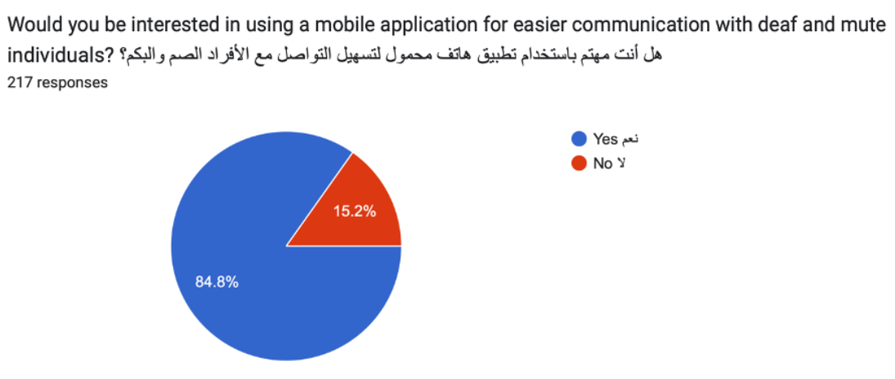
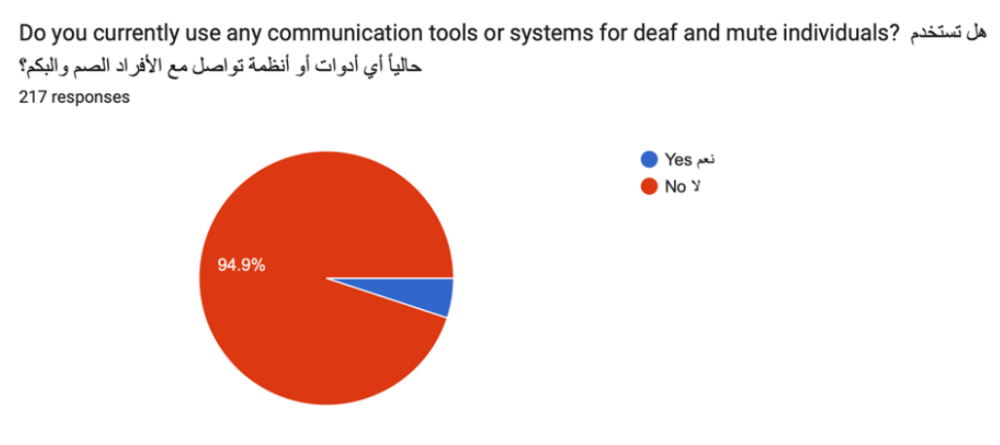
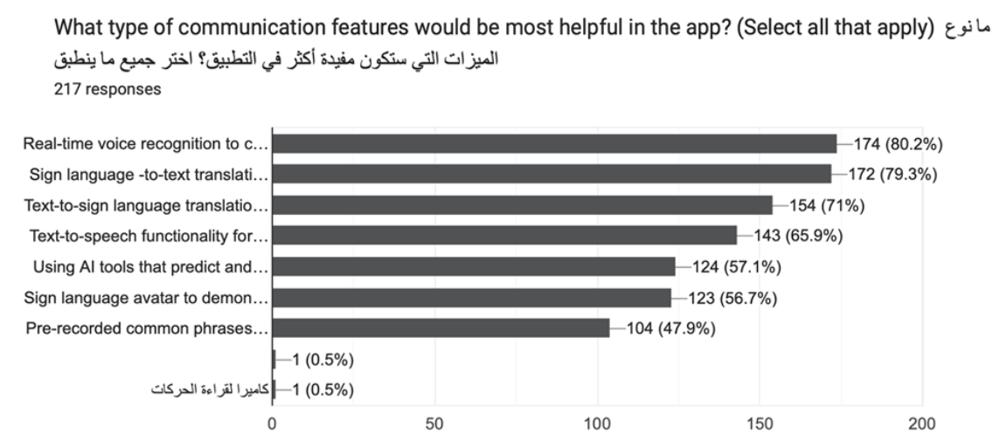
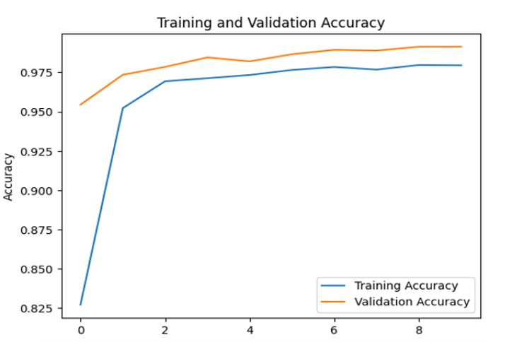
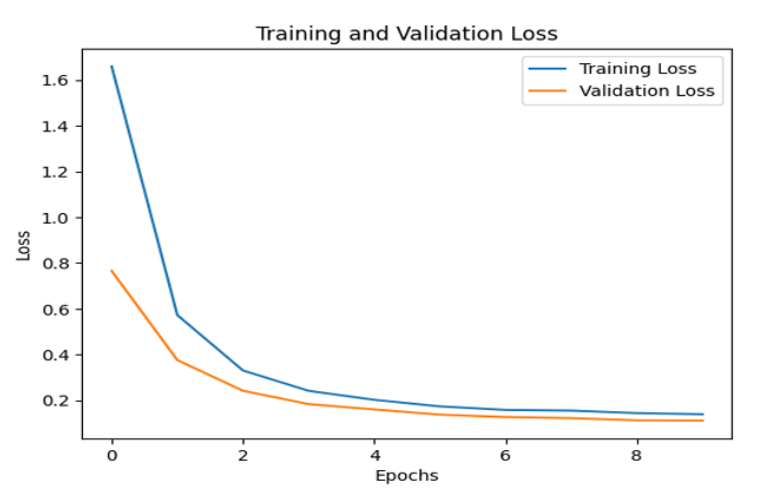

# 🤟 WASIF – AI-Powered Arabic Sign-Language Translator

**WASIF** is a cross-platform, real-time system that bridges the communication gap between Deaf/Mute individuals and the hearing community by translating Arabic Sign Language gestures to speech/text ⇄ and spoken Arabic to animated sign language.

> **University Capstone** — Princess Nourah bint Abdulrahman University, Dept. of Computer Science  
> **Academic Year** 2024 – 2025
> 
> **Supervisor** Dr. Eman Abdullah AlDakheel  

---

## Project Team
| Name | Role |
|------|------|
| **Layan Yahya Almegbil** | Computer-Vision & ML Lead |
| **Abeer Sultan AlAbdullatif** | Mobile Integration |
| **Rimas Turki AlAqil** | UX / Back-end |
| **Haifa Abdulkarim Alkhalaf** | Data & Evaluation |

---
## Problem & Objective
Millions of Deaf and Mute individuals still lack reliable, inclusive communication tools—especially for Arabic.  
**WASIF** empowers users to:

* **Sign → Speech/Text:** Recognise Arabic sign gestures and vocalise them in natural Arabic.
* **Speech/Text → Sign:** Convert spoken or typed Arabic into expressive 3-D avatar signs.
* Work **offline** and in **real time**, on modern iOS & Android devices.

---

## User Insights (Survey n = 217)
| Interest in an App | Current Tools in Use | Most-Desired Features |
|--------------------|----------------------|-----------------------|
|  |  |  |

Key take-aways → 85 % want such an app, 95 % currently use **no** tools, and real-time voice/sign translation tops the feature wish-list.

---

## Core Features
* **Realtime Gesture Recognition** – MediaPipe hands + CNN-BiLSTM (KARSL-502, 3 M images).
* **Arabic Speech Synthesis** – gTTS for high-quality Arabic audio.
* **Speech-to-Sign** – STT (Transformers) → avatar animation in Unity via landmark streaming.
* **Avatar Animation** – ReadyPlayerMe / Mixamo armature, manipulated directly from Python landmark arrays.
* Offline & online modes, responsive Flutter UI, per-user sign customisation.

---

## System Components
| Pipeline | Key Steps |
|----------|-----------|
| **Sign → Speech** | Camera → MediaPipe landmarks → CNN-BiLSTM classifier → Arabic text → gTTS audio |
| **Speech → Sign** | Mic input → STT (Wav2Vec2/BERT) → gesture mapping → landmark generator → Unity avatar |

---

## Model Training Performance

Our model was trained on the **KARSL-502** dataset using a hybrid CNN + Bi-LSTM architecture.  
It achieved high accuracy and minimal overfitting over 10 epochs.

### 📈 Accuracy & Loss Curves

| Training vs Validation Accuracy | Training vs Validation Loss |
|----------------------------------|-----------------------------|
|  |  |

---

## Visual Project Poster

---

## Final Presentation  
[Review the presentation (PDF)](presentation/Presentation_of_WASIF.pdf)
